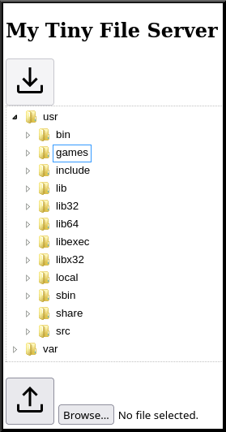

# My Tiny File Server

##### A small Spring Boot based file server with up- and download features

**Motivation**

 - Problems with VPN on latest Android
 - Don't want to share private data with public clouds from M$, Google, ...

**Solution**

A Spring Boot based server that provides
 
 - a tree view of "root" folders to download files from
 - an upload option  

 
 
 
**Usage**
 
Download directories:

A comma separated list of directories: --downloadPaths=/path/to/some/folder,/path/to/some/other/folder, ... 

Do NOT use whitespaces between commas.

Upload directory:

--uploadPath=/path/to/upload/folder

Symbolic links are not supported.

Logging:

Default log folder is the home directoy of the current user.

Default log file name is fileserver.log

Use -DlogDir=... and -DlogFile=... respectively to change the defaults.
